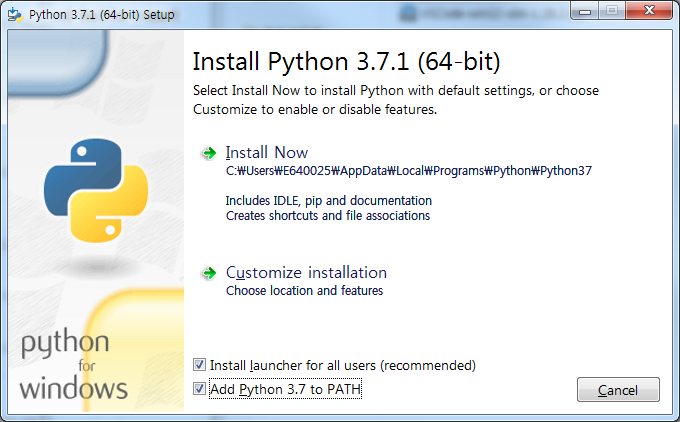
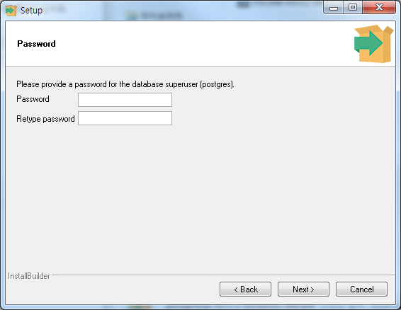
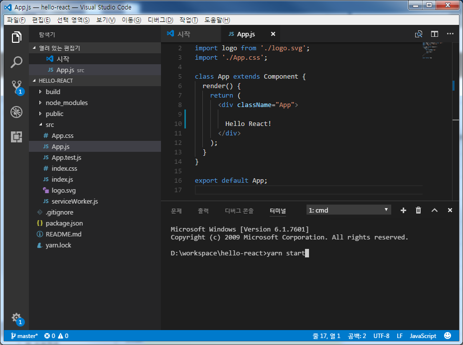
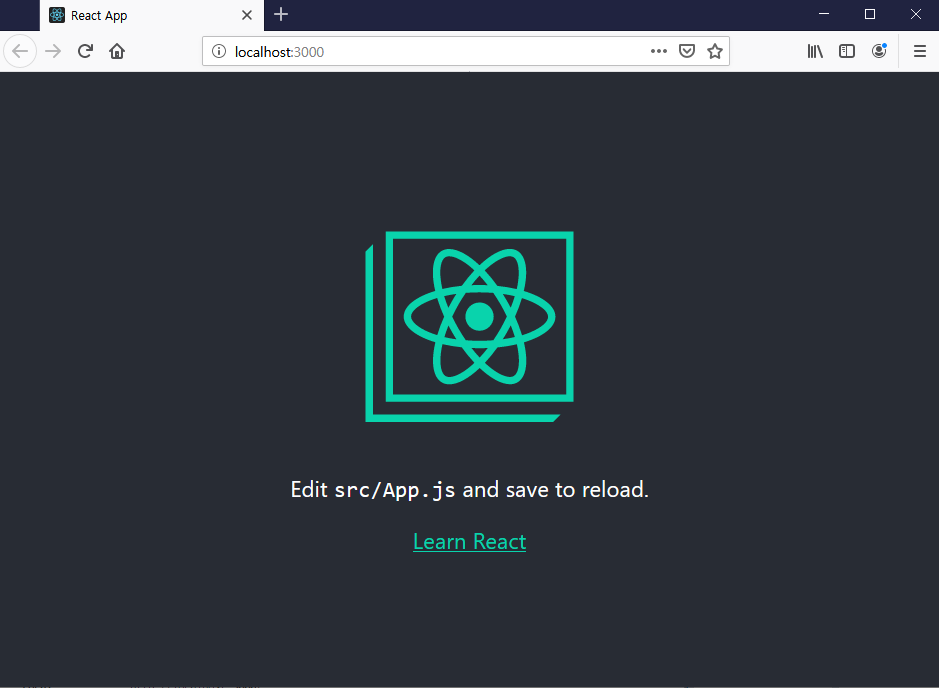

flask-react-study2

19-10-01 ~ 


# 1. node.js, postgresql, python 설치 #


https://www.python.org
https://www.postgresql.org/download/
https://nodejs.org/ko/
https://code.visualstudio.com/
 
위 4개 URL 접근하시어 python, postgresql, nodejs, visualstudio를
최신버전으로 설치해주시기 바랍니다. <br>
 
# 주의사항
# 버전이 너무 높으면 안됩니다.
# node는 v16, python은 3.7, postgreSQL은 14로 진행해주세요


### (1) python ###

 
```(중요!!)```
    설치 시작 단계에 PATH에 정보를 등록하겠느냐고 묻는 부분이 있습니다. 반드시 체크해주셔야 합니다.



 

### (2) postgresql ###

설치 시 DB 로그인 password를 지정하는 부분이 있습니다.<br>
추후 flask 에서 db 로그인 시 사용해야 하므로 기억하기 쉬운 패스워드로 설정하셔야 합니다.<br>

 



 

### (3) node.js ###

 

아무것도 건드리지 마시고 next만 연타해서 설치하시면 됩니다.<br>

 

# 3. 사전 준비 #

 

### (1) react 학습에 필요한 npm 패키지 설치 ###

 
```
(아무위치에서나)
npm install -g create-react-app yarn
```
 

### (2) workspace로 잡을 directory( D:\workspace 라고 가정)에서 리액트 튜토리얼을 생성 ###

 
```
cd d:\workspace
create-react-app hello-react
```


### (3) 튜토리얼 react 페이지 실행 ###

 

vs code를 실행하시고  파일 > 폴더 열기 > d:\workspace\hello-react 선택

ctrl + ` 입력해서 cmd 창 띄우고

```
yarn start
```
 


 

### (4) http://localhost:3000 에 웹 브라우저로 접속해서 확인 ###

 

```(중요!)```

개발 진행 간에 디버깅을 수월하게 하려면 chrome 브라우저를 사용하는 것이 좋습니다.<br>
혹 현재 PC에서 chrome 사용이 안되신다면 예외 신청을 진행 부탁 드립니다.<br>

 

### (5) 향후 사용할 npm 패키지 미리 설치 ###

 

아래 패키지를 모두 설치해두시면 스터디의 마지막까지 별도로 설치할 패키지는 없을 것입니다.

 
```
(아무위치에서나)
pip install sqlalchemy psycopg2-binary flask marshmallow flask-cors
```

 
```
cd d:\workspace\hello-react
npm install --save antd axios bootstrap react react-dom react-router-dom react-scripts reactstrap
    
```

